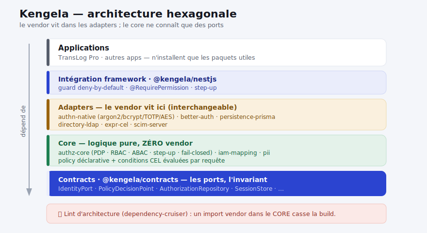
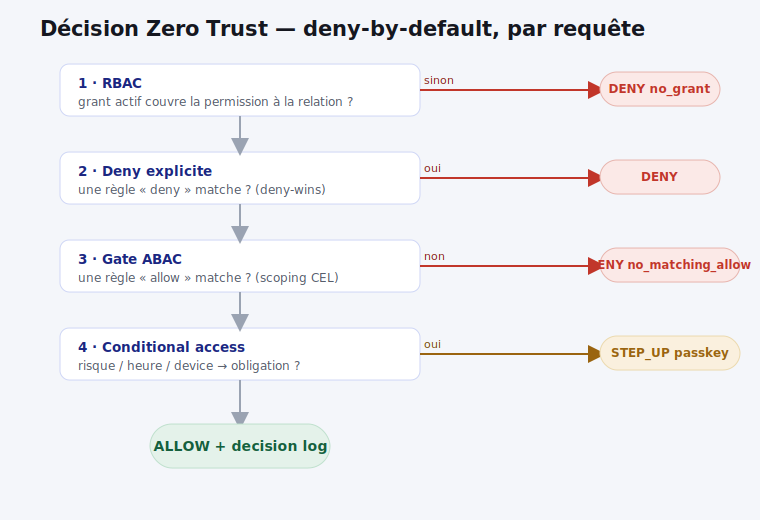

<div align="center">


# Kengela

**kokéngela** _(lingala)_ — veiller, garder, être vigilant.
Le veilleur : ne fait **jamais** confiance par défaut, vérifie **en continu**.

Socle **identité &amp; accès Zero Trust** multi-tenant pour TypeScript —
**authentification + autorisation + fédération d'identité + conformité**.


</div>

---

## Pourquoi Kengela

Une seule brique pour l'identité et l'accès de tes applications, plutôt que de réinventer
la roue à chaque projet. Née de la consolidation de deux bases réelles (Atrium et TransLog Pro).

- **Autorisation « Entra-like »** : RBAC scopé + relation organisationnelle + **ABAC** (conditions
  CEL) + **conditional access** (géo/heure/device/risque) + **step-up** — deny-by-default, fail-closed.
- **Authentification durcie** : credential **timing-safe** (argon2id/bcrypt), sessions opaques,
  **MFA/TOTP** complet, chiffrement **AES-256-GCM**, **crypto-shredding** (RGPD).
- **Fédération** : normalisation de **6 sources IdP** (OIDC/SCIM/SAML/LDAP/Graph/Google), serveur
  **SCIM 2.0** conforme **Microsoft Entra**, connecteur AD/LDAP.
- **Conformité intégrée** : classification PII, minimisation, rétention, effacement.
- **Abstraction totale** : le cœur ne connaît aucun vendor ; tu ne prends que ce dont tu as besoin.

## Architecture

<div align="center"></div>

**Le port est un sas, pas une planque.** On enveloppe l'existant derrière des ports ; tout ce qui
est faible a une cible de migration tracée (`DEBT.md` par paquet). Un **lint d'architecture**
(`pnpm lint:arch`) casse la build si un paquet du cœur importe un vendor.

## Décision Zero Trust

<div align="center"></div>

Chaque requête est évaluée **par le PDP** : plancher RBAC → deny explicite prioritaire → gate ABAC
(scoping déclaratif) → conditional access (step-up) → allow, le tout tracé en **decision log**.
Une condition inévaluable ⇒ **refus** (fail-closed).

## Paquets

| Paquet                                | Rôle                                                                                                                  |
| ------------------------------------- | --------------------------------------------------------------------------------------------------------------------- |
| `@kengela/contracts`                  | Ports &amp; types — l'invariant, zéro vendor                                                                          |
| `@kengela/authz-core`                 | RBAC scopé + relation + ABAC (CEL) + conditional access + step-up ; deny-by-default, fail-closed, decision logs       |
| `@kengela/iam-mapping`                | Normalisation **6 sources IdP** + schéma **SCIM canonique** (superset Okta/Entra) + moteur de règles                  |
| `@kengela/adapter-expr-cel`           | Moteur **CEL** (conditions ABAC + fonctions de dates)                                                                 |
| `@kengela/adapter-authn-native`       | Credential **timing-safe** (argon2/bcrypt + `needsRehash`), sessions, **MFA/TOTP**, **AES-256-GCM**, crypto-shredding |
| `@kengela/adapter-authn-better-auth`  | `IdentityPort` au-dessus de **better-auth** (OIDC/OAuth/SSO) — better-auth en `peerDependency`                        |
| `@kengela/adapter-persistence-prisma` | Stockage (`AuthorizationRepository`/`SessionStore`/`PolicyStore`) via interface Prisma narrow                         |
| `@kengela/adapter-directory-ldap`     | Connecteur **AD/LDAP** (ldapts) → `DirectoryProfile`                                                                  |
| `@kengela/scim-server`                | Serveur **SCIM 2.0** Users+Groups + découverte + **conformité Entra** + validation de schéma                          |
| `@kengela/nestjs`                     | Intégration **NestJS** : guard deny-by-default + décorateurs + step-up                                                |
| `@kengela/pii`                        | Conformité **RGPD** : classification, minimisation, redaction, rétention, effacement                                  |
| `@kengela/connector-translog`         | _(privé)_ mapping du schéma TransLog Pro vers les ports Kengela                                                       |

## Démarrage rapide

```sh
pnpm install
pnpm -r build && pnpm -r test   # TS6 strict, ESLint strictTypeChecked, tout vert
pnpm lint:arch                  # garde-fou anti-vendor sur le cœur
```

Une application n'installe que les paquets utiles :

```sh
npm add @kengela/authz-core @kengela/nestjs @kengela/adapter-persistence-prisma
```

## Documentation

Guides d'implémentation, d'utilisation et de développement : **[`docs/guide/`](docs/guide/)**.
Publication &amp; consommation : **[`PUBLISHING.md`](PUBLISHING.md)**. Conception : **[`docs/`](docs/)**.

## Licence

**Apache-2.0** © 2026 yannds — voir [`LICENSE`](LICENSE) et [`NOTICE`](NOTICE).
Licence permissive avec clause de brevet ; le détenteur du copyright conserve la possibilité
d'un double-licensing commercial ultérieur.
